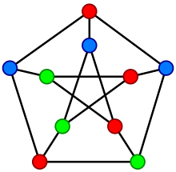

# Vertex Coloring

### Understanding the problem
Graph coloring, a fundamental concept in graph theory, involves assigning labels, traditionally referred to as "colors," to elements of a graph while adhering to specific constraints. The most common type, vertex coloring, assigns colors to graph vertices such that no two adjacent vertices share the same color. Similarly, edge coloring ensures that no two edges sharing a common vertex have the same color, while face coloring, applicable to planar graphs, assigns colors to regions or faces so that neighboring faces with a shared boundary have different colors. Graphs considered in this context are assumed to be loopless, as a vertex with a loop (an edge connecting it to itself) cannot be properly colored.

The use of "colors" for labeling vertices originates from map coloring. While colors like red and blue are sometimes used for small graphs, it is generally understood that the labels are represented by integers, such as {1, 2, 3, ...}.



A proper vertex coloring of the Petersen graph with 3 colors, the minimum number possible.
### Dependances
This project is built and compiled in c++, using the sfml library on for things input and graphics. Any other dependances are stated here
* iostream
* string
* random

### Running the program
Any changes made will need to be compiled using ```g++```. I am running linux *Ubuntu 22.04.5 LTS*.
The program can be comipled using this command

```g++ main.cpp -o sfml-app -lsfml-graphics -lsfml-window -lsfml-system```

And Run using this command

```./sfml-app```

#### Notes
* Make sure you are in the projects directory before running any commands
* to install sfml on ubuntu, run ```sudo apt-get install libsfml-dev```